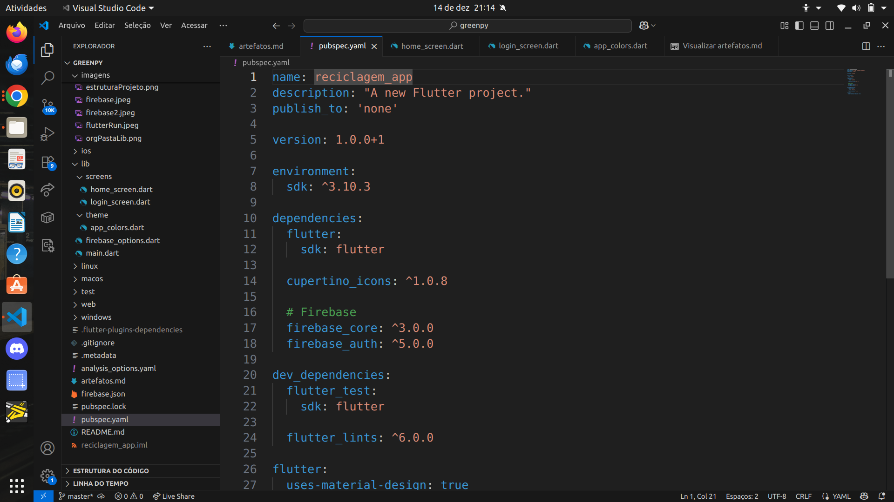
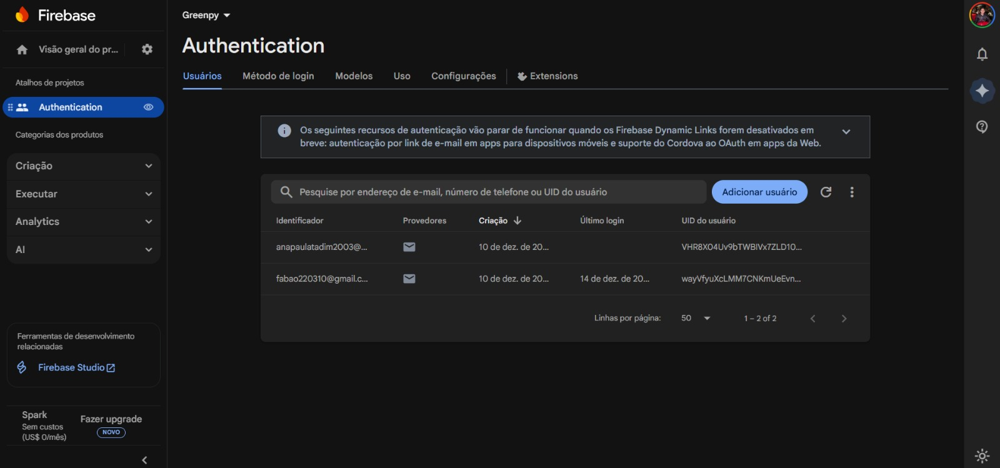
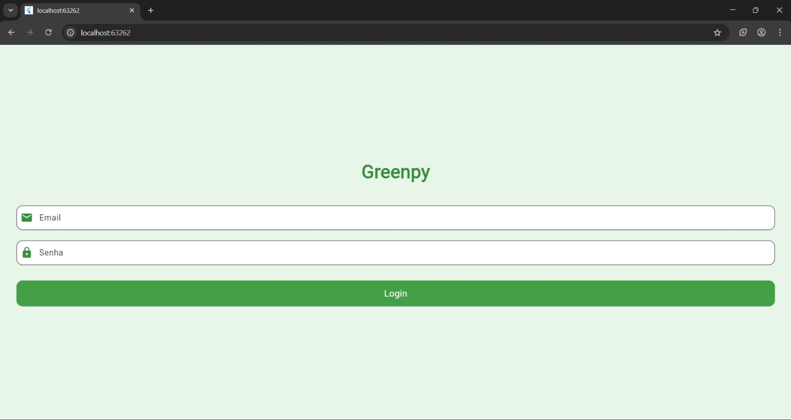

# Artefatos e Entregas

Este documento apresenta as evidências de entrega de cada Sprint do projeto **GREENPY**, detalhando o que foi implementado, os responsáveis e os links diretos para o código-fonte, garantindo a rastreabilidade do desenvolvimento.

---

## Sprint 1 – Configuração Inicial e Arquitetura
**Foco:** Preparação do ambiente de desenvolvimento, criação do projeto Flutter e configuração inicial dos serviços.

### 1. Inicialização do Projeto Flutter
**Descrição:**
Criação da estrutura base do aplicativo utilizando o framework Flutter, por meio do comando `flutter create`. Essa etapa definiu a organização inicial das pastas e arquivos do projeto, possibilitando o desenvolvimento multiplataforma (Android, iOS, Web, Windows, Linux e macOS).

**Responsável:** Ana Clara

**Código-fonte:**
- `/lib/main.dart`
- Estrutura principal do projeto Flutter

**Evidência:**
Figura 1 – Estrutura inicial do projeto Flutter.

---

### 2. Organização da Arquitetura do Projeto
**Descrição:**
Definição da pasta `lib/` como núcleo do projeto, onde será concentrada toda a lógica da aplicação, incluindo telas, serviços e modelos. Essa organização facilita a manutenção e a evolução do sistema ao longo das Sprints.

**Responsável:** Ana Paula

**Código-fonte:**
- `/lib/`

**Evidência:**
Figura 2 – Organização da pasta lib.

---

### 3. Configuração de Dependências
**Descrição:**
Configuração do arquivo `pubspec.yaml`, com a definição do nome do projeto, descrição, versão inicial e dependências necessárias para o desenvolvimento do aplicativo.

**Responsável:** Michelle Pinheiro

**Código-fonte:**
- `pubspec.yaml`

**Evidência:**
Figura 3 – Configuração das dependências do projeto no arquivo `pubspec.yaml`.

---

## Sprint 2 – Autenticação e Interface Inicial
**Foco:** Implementação da autenticação de usuários e desenvolvimento das primeiras interfaces visuais do sistema.

### 1. Integração com Firebase
**Descrição:**
Configuração do projeto no Firebase, permitindo a futura utilização de serviços como autenticação e banco de dados. Foram realizados os ajustes necessários para integração do Firebase com o aplicativo Flutter.

**Responsável:** Fábio Tavares

**Código-fonte:**
- `firebase.json`
- Configurações no `pubspec.yaml`

**Evidência:**
Figura 4 – Projeto GREENPY configurado no Firebase Console.

---

### 2. Serviço de Autenticação
**Descrição:**
Implementação da lógica de autenticação utilizando serviços do Firebase, permitindo o login e cadastro de usuários por meio de e-mail e senha.

**Responsável:** Michelle Pinheiro

**Código-fonte:**
- `/lib/services/auth_service.dart` (ou equivalente)

---

### 3. Tela de Login e Cadastro
**Descrição:**
Desenvolvimento das interfaces de login e cadastro de usuários, contendo campos de entrada, validação básica e botões de ação, seguindo os padrões visuais do Flutter.

**Responsável:** Otávio Alves

**Código-fonte:**
- `/lib/screens/login_screen.dart`
- `/lib/screens/register_screen.dart`

**Evidência:**
Figura 5 – Tela de login do aplicativo GREENPY.

---

### 4. Tela Inicial (Home)
**Descrição:**
Criação da tela inicial exibida após a autenticação bem-sucedida do usuário, utilizando os componentes básicos do Flutter, como `Scaffold`, `AppBar` e estrutura inicial de navegação.

**Responsável:** Otávio Alves

**Código-fonte:**
- `/lib/screens/home_screen.dart`

**Evidência:**
Figura 6 - Evidência da autenticação do usuário bem sucedida

---

## Considerações Finais
Ao final dessas Sprints, o projeto GREENPY possui uma base sólida de arquitetura, integração com serviços externos e interfaces iniciais funcionais, permitindo a continuidade do desenvolvimento das funcionalidades principais nas próximas etapas.

